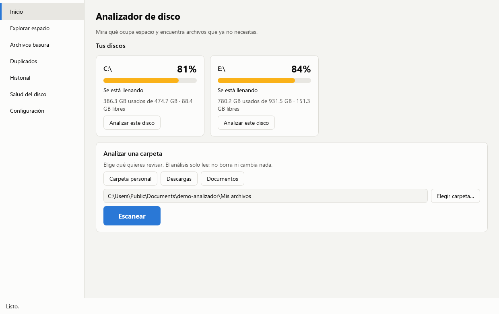
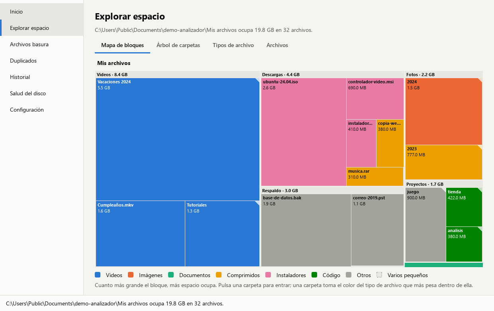
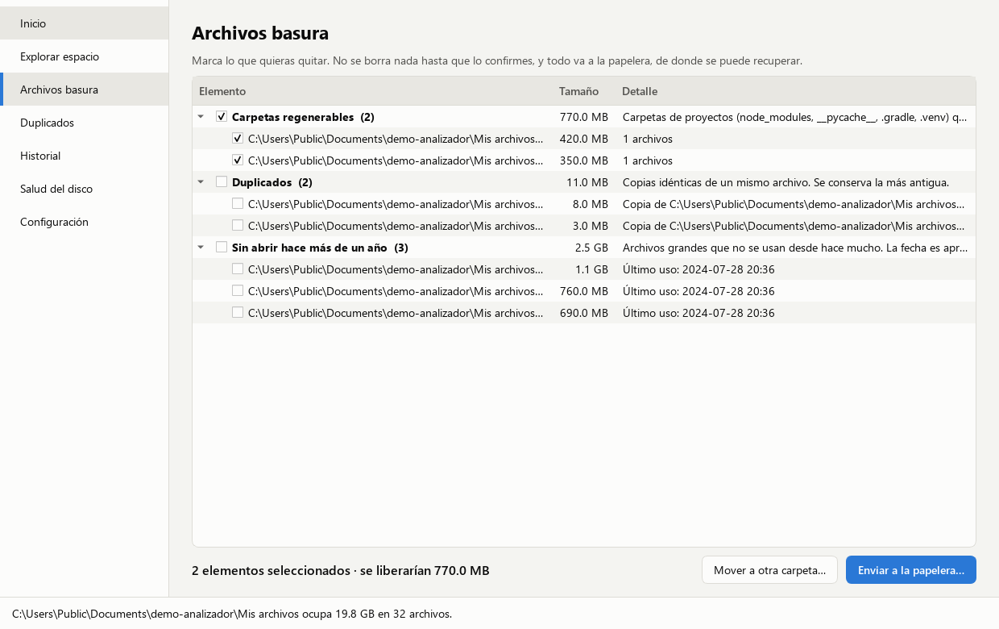
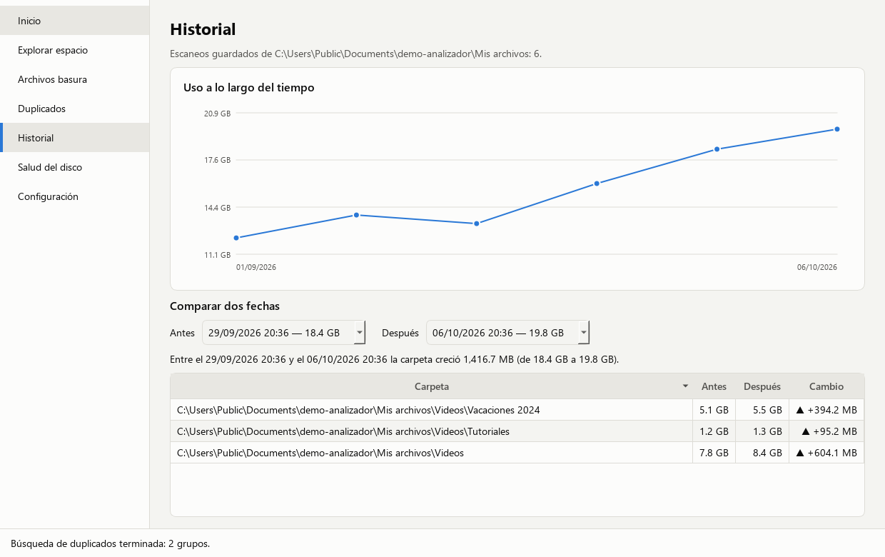
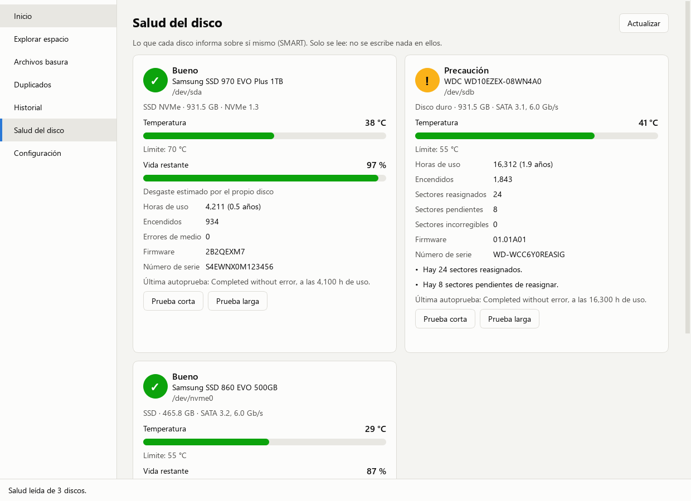

# Guía de uso de Analizador de disco

Esta guía es para quien usa el programa, no para quien lo programa. Explica
cómo instalarlo, cómo encontrar qué ocupa espacio, cómo limpiar con seguridad
y cómo comprobar la salud de tus discos.

**Contenido**

1. [Instalar el programa](#1-instalar-el-programa)
2. [La primera vez](#2-la-primera-vez)
3. [Escanear una carpeta o un disco](#3-escanear-una-carpeta-o-un-disco)
4. [Ver qué ocupa espacio](#4-ver-qué-ocupa-espacio)
5. [Limpiar archivos basura](#5-limpiar-archivos-basura)
6. [Duplicados](#6-duplicados)
7. [Mover archivos a otro disco](#7-mover-archivos-a-otro-disco)
8. [Historial](#8-historial)
9. [Salud del disco](#9-salud-del-disco)
10. [Configuración](#10-configuración)
11. [Preguntas frecuentes](#11-preguntas-frecuentes)
12. [Desinstalar](#12-desinstalar)

> **Lo más importante en tres líneas.** El programa solo mira; no cambia nada
> hasta que tú lo confirmas. Borrar significa enviar a la papelera, de donde
> se puede recuperar. Y no envía tus datos a ningún sitio.

---

## 1. Instalar el programa

Descarga el archivo de tu sistema desde la
[página de versiones](https://github.com/alonsogvg21-bit/analizador-disco/releases/latest).
No hace falta instalar nada más.

### Windows 10 y 11

1. Descarga `AnalizadorDisco-X.Y.Z-windows-x64-setup.exe`.
2. Haz doble clic. Si aparece el aviso azul **"Windows protegió su PC"**, pulsa
   **Más información** y después **Ejecutar de todas formas**. El aviso sale
   porque el instalador no está firmado, no porque haya un problema.
3. Sigue el asistente (está en español). No pide contraseña de administrador.
4. Abre **Analizador de disco** desde el menú Inicio.

**Sin instalar:** si prefieres no instalar nada, descarga el archivo
`...-portable.zip`, descomprímelo en cualquier carpeta y abre
`AnalizadorDisco.exe`.

### Ubuntu, Debian y Linux Mint

1. Descarga `analizador-disco_X.Y.Z_amd64.deb`.
2. Abre una terminal en la carpeta de la descarga y ejecuta:

   ```bash
   sudo apt install ./analizador-disco_X.Y.Z_amd64.deb
   ```

3. Búscalo en el menú de aplicaciones como **Analizador de disco**.

### Otras distribuciones de Linux

1. Descarga `AnalizadorDisco-X.Y.Z-x86_64.AppImage`.
2. Dale permiso de ejecución (clic derecho > Propiedades > Permisos, o
   `chmod +x` en una terminal) y ábrelo con doble clic.

---

## 2. La primera vez

Al abrir el programa por primera vez aparece una introducción de tres pasos.
Resume qué hace, qué no hará nunca sin tu permiso y que no envía datos.
En el último paso marca la casilla y pulsa **Empezar**.

Puedes volver a verla en **Configuración > Ver de nuevo la introducción**.

La ventana tiene una barra a la izquierda con siete secciones. Abajo hay una
barra de estado que te va contando qué está haciendo el programa.



---

## 3. Escanear una carpeta o un disco

Escanear es mirar qué hay y cuánto ocupa. No cambia nada.

1. Ve a **Inicio**.
2. Elige qué revisar:
   - un atajo (**Carpeta personal**, **Descargas**, **Documentos**...);
   - un disco entero, con **Analizar este disco** en su tarjeta;
   - cualquier otra carpeta, con **Elegir carpeta…**.
3. Pulsa **Escanear**.

Mientras escanea puedes seguir usando la ventana. La barra de abajo muestra
cuántos archivos lleva. Para detenerlo, pulsa **Cancelar** o la tecla **Esc**.

**Cuánto tarda.** La carpeta de Descargas, unos segundos. La carpeta personal
completa, varios minutos. Un disco entero, más.

**Consejo.** La primera vez prueba con **Descargas**: es rápido y suele haber
mucho que limpiar.

Si al terminar dice que algunos elementos "se ignoraron", es normal: son
carpetas del sistema que no se pueden leer sin permisos especiales.

---

## 4. Ver qué ocupa espacio

Al terminar el escaneo se abre **Explorar espacio**, con cuatro pestañas.

### Mapa de bloques



Cada rectángulo es una carpeta o un archivo. **Cuanto más grande, más espacio
ocupa.** El color indica el tipo (la leyenda está debajo).

- **Pasa el ratón** por un bloque para ver su nombre, su tamaño y qué
  porcentaje de su carpeta representa.
- **Haz clic en una carpeta** para entrar en ella. Las carpetas llevan una
  esquina doblada.
- **Para volver**, usa la ruta que hay encima del mapa (por ejemplo
  `Descargas › Videos`).

### Árbol de carpetas

La lista clásica: carpetas de mayor a menor, con su tamaño y su porcentaje.
Pulsa la flecha de una carpeta para ver qué hay dentro.

### Tipos de archivo

Cuánto ocupan en total los videos, las imágenes, los documentos, etc.

### Archivos

Una tabla con los archivos más grandes.

- **Para ordenar**, pulsa el título **Tamaño**, **Modificado** o **Último
  acceso**. Púlsalo otra vez para invertir el orden.
- **Para filtrar**, elige un tipo o escribe un tamaño mínimo.
- **Para seleccionar varios**, usa Ctrl o Mayús mientras haces clic.

### Clic derecho

Sobre cualquier archivo o carpeta, en cualquiera de las vistas:

- **Abrir ubicación**: abre la carpeta donde está.
- **Copiar ruta**.
- **Mover a otra carpeta…**
- **Enviar a la papelera…**

---

## 5. Limpiar archivos basura

Ve a **Archivos basura**. El programa agrupa lo que probablemente no
necesitas:

| Categoría | Qué es | ¿Es seguro quitarlo? |
|---|---|---|
| Archivos temporales | Restos que dejan los programas mientras trabajan | Sí. Los usados en las últimas 24 horas no se pueden marcar |
| Caché | Copias que guardan los navegadores para ir más rápido | Sí; se vuelve a crear sola. Cierra antes el navegador |
| Carpetas regenerables | Carpetas de proyectos de programación que se recrean con un comando | Sí, si sabes qué son |
| Duplicados | Copias idénticas de un archivo | Revisa antes: quizá quieres las dos |
| Sin abrir hace más de un año | Archivos grandes que no usas | Revisa antes: son archivos tuyos |
| Papelera, Descargas, Registros | Solo se muestra cuánto ocupan | No se pueden marcar |



### Paso a paso

1. Despliega una categoría y **marca** lo que quieras quitar. Marcar la
   categoría marca todo lo que contiene.
2. Abajo verás cuánto espacio se liberaría.
3. Pulsa **Enviar a la papelera…**
4. Aparece una ventana con la **lista exacta**. Fíjate en la casilla
   **Solo simular**: viene marcada.
   - **Con la casilla marcada**, pulsa **Simular**: el programa te dice qué
     pasaría, sin tocar nada. Úsalo para comprobar.
   - **Para hacerlo de verdad**, desmarca la casilla y pulsa **Sí, enviar a la
     papelera**.
5. Si son más de 1 GB, te preguntará una segunda vez.

### Qué pasa con lo que borras

- Va a la **papelera** de tu sistema. Puedes restaurarlo desde ahí.
- **El espacio no se recupera hasta que vacías la papelera.**
- Si un archivo está abierto en otro programa, se salta y se te avisa.

### Lo que el programa nunca hará

- Tocar las carpetas del sistema (Windows, Archivos de programa, `/usr`...).
- Sugerir como basura nada de tus carpetas **Documentos**, **Escritorio** o
  **Imágenes**.
- Borrar algo sin enseñarte antes la lista y pedirte confirmación.

---

## 6. Duplicados

1. Escanea una carpeta.
2. Ve a **Duplicados** y pulsa **Buscar duplicados**. En carpetas grandes
   puede tardar, porque compara el contenido de los archivos.
3. Cada grupo muestra un **original** (el más antiguo, que no se puede marcar)
   y sus **copias**.
4. Marca las copias que sobren, o pulsa **Marcar todas las copias**.
5. Pulsa **Enviar a la papelera…** o **Mover a otra carpeta…**

El **tamaño mínimo** sirve para ignorar archivos pequeños e ir más rápido.

---

## 7. Mover archivos a otro disco

Útil para liberar espacio sin borrar: por ejemplo, llevar videos a un disco
externo.

1. Selecciona los archivos en la tabla **Archivos**, o márcalos en **Archivos
   basura** o **Duplicados**.
2. Pulsa **Mover…** (o clic derecho > **Mover a otra carpeta…**).
3. Elige la carpeta de destino con **Elegir carpeta…**. Debe existir.
4. Simula primero, y después desmarca **Solo simular** y confirma.

- Si en el destino ya hay un archivo con ese nombre, **no se sobrescribe**: se
  guarda como `nombre (1)`.
- Antes de empezar se comprueba que en el destino cabe todo.

---

## 8. Historial

Cada vez que termina un escaneo, el programa guarda cuánto ocupaba esa
carpeta. Con dos o más escaneos de la misma carpeta, en **Historial** verás:

- una **gráfica** de cómo ha cambiado el espacio ocupado;
- una **comparación** entre dos fechas, con las carpetas que más crecieron o
  disminuyeron.



Sirve para responder a "¿qué me ha llenado el disco este mes?".

---

## 9. Salud del disco

Los discos llevan un sistema de autodiagnóstico llamado **SMART**: van
anotando su temperatura, sus horas de uso y si tienen zonas dañadas. Esta
sección lee esos datos y te dice si el disco está bien.

Para leerlos hace falta una herramienta gratuita llamada **smartmontools**,
que no viene incluida y se instala aparte. Solo se hace una vez.

### 9.1 Instalar smartmontools en Windows

**Opción A: con un comando (la más rápida)**

1. Pulsa la tecla Windows, escribe **PowerShell** y ábrelo.
2. Copia y pega este comando, y pulsa Intro:

   ```powershell
   winget install smartmontools.smartmontools
   ```

3. Si pregunta si aceptas los términos, escribe `S` y pulsa Intro. Si Windows
   pide permiso para hacer cambios, acepta.
4. Espera a que diga que se instaló correctamente.

**Opción B: con el instalador**

1. Entra en <https://www.smartmontools.org> y ve a **Download**.
2. Descarga el instalador para Windows (un archivo que termina en `.win32-setup.exe`).
3. Ábrelo y pulsa **Next** / **Install** dejando las opciones como vienen.

**Comprobar que quedó instalado.** Cierra PowerShell, vuelve a abrirlo y
ejecuta:

```powershell
smartctl --version
```

Debe responder con una línea que empieza por `smartctl 7`. Si dice que no
reconoce el comando, no te preocupes: el programa también lo busca en
`C:\Program Files\smartmontools`, que es donde se instala.

### 9.2 Instalar smartmontools en Linux

Abre una terminal y ejecuta el comando de tu distribución:

| Distribución | Comando |
|---|---|
| Ubuntu, Debian, Linux Mint | `sudo apt install smartmontools` |
| Fedora | `sudo dnf install smartmontools` |
| Arch, Manjaro | `sudo pacman -S smartmontools` |
| openSUSE | `sudo zypper install smartmontools` |

Para comprobarlo: `sudo smartctl --version`.

### 9.3 Ver la salud

1. **Cierra y vuelve a abrir** Analizador de disco después de instalar smartmontools.
2. Ve a **Salud del disco**. Aparece una tarjeta por cada disco.



Si en lugar de las tarjetas ves las instrucciones de instalación, es que el
programa no encuentra smartmontools: repasa el paso anterior.

### 9.4 Si un disco pide permiso

Algunos discos (sobre todo los externos por USB) solo se dejan leer por un
administrador. En ese caso su tarjeta muestra el modelo y el tamaño, y un
botón **Dar permiso y leer salud**.

1. Pulsa el botón.
2. **Windows** mostrará su aviso de seguridad ("¿Quieres permitir que esta
   aplicación haga cambios?"): pulsa **Sí**. **Linux** pedirá tu contraseña.
3. Se leen todos los discos de una vez.

Qué debes saber:

- El permiso se usa **solo para leer** esos datos. No se escribe nada en el disco.
- El programa nunca lo pide por su cuenta: solo cuando pulsas el botón.
- Si dices que no, no pasa nada. El botón sigue ahí.
- No hace falta abrir el programa "como administrador".

### 9.5 Qué significa cada estado

| Estado | Significado | Qué hacer |
|---|---|---|
| 🟢 **Bueno** | No hay ninguna señal de problema | Nada. Sigue haciendo copias de seguridad |
| 🟡 **Precaución** | Funciona, pero hay señales de desgaste o está caliente | Haz una copia de seguridad y vuelve a mirar en unas semanas |
| 🔴 **Malo** | El disco avisa de un fallo | **Copia tus datos cuanto antes** y sustituye el disco |
| ⚪ **Sin datos** | Faltan permisos, o el disco no ofrece esta información | Pulsa el botón de permiso. Las memorias USB no suelen ofrecerla |

Debajo del estado, la tarjeta explica el motivo cuando no es "Bueno".

### 9.6 Qué significa cada dato

| Dato | Qué es | Qué es normal |
|---|---|---|
| **Temperatura** | Los grados del disco ahora | Entre 25 y 50 °C. Los SSD de tipo NVMe llegan a 60–70 °C trabajando |
| **Vida restante** (solo SSD) | Desgaste estimado por el fabricante | 100 % es nuevo. Por debajo del 20 % conviene ir pensando en cambiarlo |
| **Horas de uso** | Tiempo total que ha estado encendido | Solo informativo |
| **Encendidos** | Veces que se ha encendido | Solo informativo. Algunos SSD cuentan también cada vez que el equipo los pone en reposo y dan cifras enormes: el programa lo indica con un asterisco |
| **Sectores reasignados** | Zonas dañadas que el disco sustituyó por otras de reserva | Debe ser 0 |
| **Sectores pendientes** | Zonas dudosas, aún sin sustituir | Debe ser 0. Es la señal más temprana de fallo |
| **Sectores incorregibles** | Zonas que no se pudieron leer | Debe ser 0 |
| **Errores de medio** (NVMe) | Lecturas o escrituras que fallaron | Debe ser 0 |

**Importante.** Un disco puede fallar de repente aunque todo esté en verde.
"Bueno" no sustituye a tener copia de seguridad de lo que te importa.

### 9.7 Autopruebas

Puedes pedirle al disco que se examine a sí mismo:

- **Prueba corta**: unos 2 minutos.
- **Prueba larga**: revisa todo el disco; puede tardar horas.

Las pruebas **no borran ni cambian tus archivos** y puedes seguir usando el
equipo. Al pulsar el botón, el sistema puede pedirte permiso. Cuando termine
el tiempo, pulsa **Actualizar** para ver el resultado en la tarjeta.

### 9.8 Avisos automáticos

En **Configuración > Alertas de salud del disco** puedes activar una
notificación de escritorio para cuando un disco empeore o se caliente
demasiado. El aviso salta al pulsar **Actualizar** en Salud del disco.

---

## 10. Configuración

| Opción | Para qué sirve |
|---|---|
| **Tema** | Claro, oscuro o el mismo que tu sistema |
| **Buscar duplicados al escanear** | Más completo, pero el escaneo tarda bastante más |
| **Empezar siempre en modo simulación** | Deja marcada la casilla "Solo simular". Recomendado |
| **Abrir el registro de acciones** | Lista de todo lo que el programa ha movido o enviado a la papelera, con fecha |
| **Ver de nuevo la introducción** | La explicación de la primera vez |
| **Alertas de salud** | Notificación y límite de temperatura |
| **Acerca de…** | Versión, licencia y licencias de terceros. También con la tecla F1 |

---

## 11. Preguntas frecuentes

**¿Puedo perder archivos por usar el programa?**
Escanear y explorar no cambian nada. Para borrar o mover, el programa te
enseña la lista y te pide confirmación, y lo borrado va a la papelera. Aun
así, revisa lo que marcas: la decisión es tuya.

**He enviado algo a la papelera por error.**
Abre la papelera de tu sistema, busca el archivo y elige **Restaurar**.

**He borrado cosas y el disco sigue igual de lleno.**
Hay que **vaciar la papelera**. Hasta entonces los archivos siguen ocupando.

**¿Por qué no me sugiere nada de Documentos?**
A propósito: lo que hay en Documentos, Escritorio e Imágenes es tuyo y nunca
se propone como basura. Puedes moverlo o borrarlo tú desde la tabla
**Archivos**, con clic derecho.

**¿Por qué algunos temporales no se pueden marcar?**
Si se han modificado en las últimas 24 horas, es probable que un programa
abierto los esté usando.

**¿Por qué no aparece ningún duplicado?**
Solo se buscan a partir de 1 MB por defecto. Baja el **Tamaño mínimo** en la
sección Duplicados.

**Los tamaños no cambian después de borrar.**
El mapa y las listas muestran el último escaneo. Vuelve a escanear para
actualizarlos.

**Salud del disco dice "Sin datos".**
Si hay un botón **Dar permiso y leer salud**, púlsalo. Si no lo hay, ese disco
no ofrece datos SMART; pasa con memorias USB y algunas cajas externas.

**Salud del disco muestra instrucciones de instalación.**
Falta smartmontools. Sigue el [apartado 9.1](#91-instalar-smartmontools-en-windows)
o el [9.2](#92-instalar-smartmontools-en-linux) y reinicia el programa.

**En Linux, al pedir permiso dice que use `sudo`.**
Tu sesión no tiene la ventana gráfica para pedir contraseñas. Abre una
terminal y ejecuta `sudo analizador-disco cli salud`.

**¿Envía mis datos a algún sitio?**
No. Todo se analiza en tu equipo. Puedes usarlo sin conexión a internet.

**¿Dónde guarda el programa su información?**
El historial, el registro de acciones y tus preferencias están en:

- Windows: `%LOCALAPPDATA%\analizador-disco`
- Linux: `~/.local/share/analizador-disco`

**Ha salido una ventana de error.**
Pulsa **Copiar detalle técnico** y pégalo al informar del problema en
<https://github.com/alonsogvg21-bit/analizador-disco/issues>.

---

## 12. Desinstalar

- **Windows**: Configuración > Aplicaciones > busca **Analizador de disco** >
  Desinstalar.
- **Ubuntu, Debian, Mint**: `sudo apt remove analizador-disco`
- **AppImage o portable**: borra el archivo o la carpeta.

Tu historial y el registro no se borran al desinstalar, por si vuelves a
instalarlo. Si no los quieres, elimina la carpeta de datos indicada en la
pregunta anterior.

Smartmontools es un programa aparte: si quieres quitarlo, desinstálalo como
cualquier otro (`winget uninstall smartmontools.smartmontools` en Windows, o
`sudo apt remove smartmontools` en Linux).
